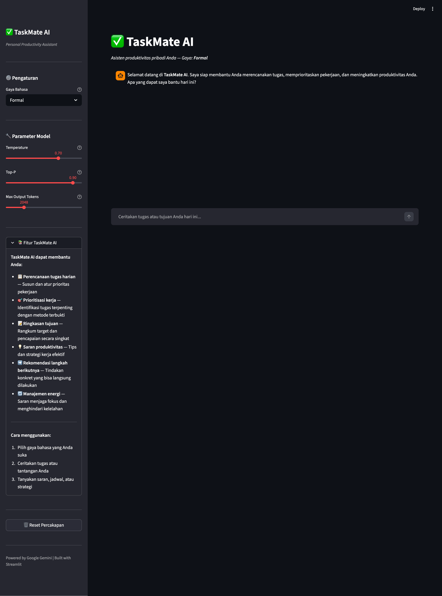
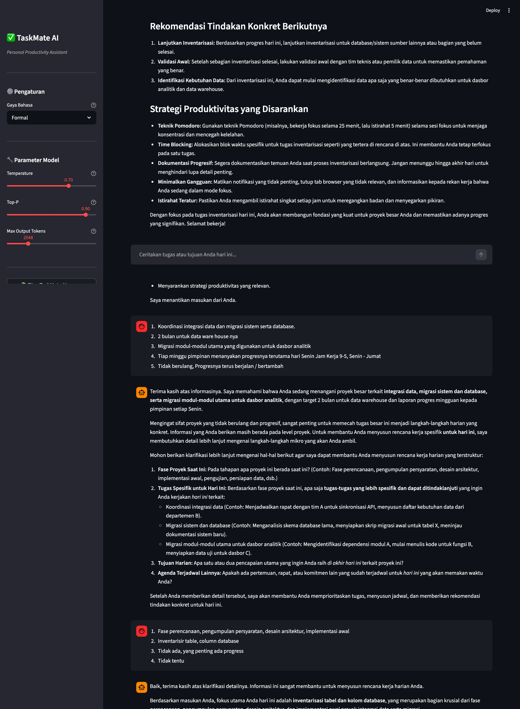
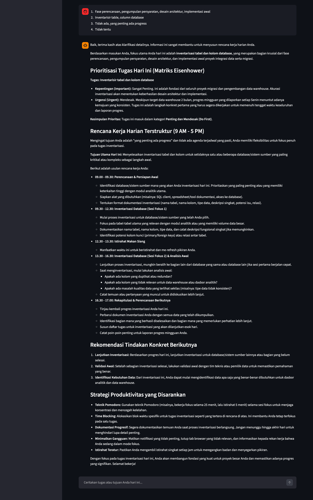

# ✅ TaskMate AI — Personal Productivity Assistant


> **Final Project — AI Chatbot berbasis LLM**
> Mata Kuliah: Data Scientist | Topik: Natural Language Processing & LLM Integration

---

## Deskripsi Proyek

**TaskMate AI** adalah chatbot asisten produktivitas pribadi berbasis Large Language Model (LLM) yang dirancang khusus untuk pekerja kantoran. Chatbot ini memanfaatkan Google Gemini API untuk memahami masukan pengguna dalam bahasa alami dan memberikan respons yang relevan, terstruktur, dan personal dalam Bahasa Indonesia.

Pengguna dapat berinteraksi dengan TaskMate AI untuk:
- Merencanakan dan mengatur tugas harian
- Mendapatkan saran prioritisasi pekerjaan
- Merangkum tujuan dan target
- Memperoleh rekomendasi strategi produktivitas
- Menentukan langkah aksi berikutnya secara konkret

---

## Fitur Utama

| Fitur | Deskripsi |
|-------|-----------|
| 🗣️ **3 Gaya Bahasa** | Formal, Santai, atau Motivasional — sesuaikan dengan suasana kerja |
| 🧠 **Chat Memory** | Riwayat percakapan tersimpan selama sesi menggunakan `st.session_state` |
| ⚙️ **Parameter Konfigurasi** | Temperature, Top-P, dan Max Output Tokens dapat diatur langsung dari sidebar |
| 💡 **Rekomendasi Cepat** | Deteksi otomatis kata kunci dan tampilkan 3 saran tindakan konkret |
| 🗑️ **Reset Chat** | Tombol untuk memulai percakapan baru dari awal |
| 📚 **Panduan Fitur** | Sidebar dengan penjelasan lengkap kemampuan chatbot |
| 🔒 **Keamanan API Key** | Tidak ada hardcoded key — gunakan env var atau Streamlit secrets |

---

## Demo / Screenshot

### Tampilan Awal

*Antarmuka bersih dengan sidebar parameter dan pesan sambutan*

### Percakapan Produktivitas

*Contoh sesi perencanaan kerja harian lengkap dengan rencana terstruktur dan matriks Eisenhower*

### Fitur Rekomendasi Cepat

*Kotak rekomendasi otomatis muncul saat chatbot mendeteksi kebutuhan saran produktivitas*

---

## Instalasi & Menjalankan Secara Lokal

### Prasyarat
- Python 3.10 atau lebih baru
- Google Gemini API Key ([dapatkan di sini](https://aistudio.google.com/app/apikey))

### Langkah-langkah

```bash
# 1. Clone repository
git clone https://github.com/username/ai-productivity-chatbot.git
cd ai-productivity-chatbot

# 2. Buat virtual environment
python -m venv venv
source venv/bin/activate        # Linux/Mac
# atau: venv\Scripts\activate   # Windows

# 3. Install dependensi
pip install -r requirements.txt

# 4. Salin file env contoh dan isi API key
cp .env.example .env
# Buka .env dan ganti "your_api_key_here" dengan API key Anda

# 5. Jalankan aplikasi
streamlit run app.py
```

Aplikasi akan terbuka otomatis di browser: `http://localhost:8501`

### Menggunakan Streamlit Secrets (Alternatif)

Buat file `.streamlit/secrets.toml`:
```toml
GOOGLE_API_KEY = "your_api_key_here"
```

---

## Deployment ke Streamlit Cloud

1. Push kode ke repository GitHub (pastikan tidak ada `.env` atau `secrets.toml`)
2. Buka [share.streamlit.io](https://share.streamlit.io) dan login
3. Klik **New app** → pilih repository dan branch
4. Set **Main file path**: `app.py`
5. Buka **Advanced settings** → **Secrets**, tambahkan:
   ```toml
   GOOGLE_API_KEY = "your_api_key_here"
   ```
6. Klik **Deploy!**

---

## Contoh Pertanyaan untuk Menguji Chatbot

Gunakan pertanyaan berikut untuk mendemonstrasikan kemampuan TaskMate AI:

1. *"Hari ini saya punya 5 meeting dan 3 laporan yang harus selesai. Bantu saya prioritaskan."*
2. *"Saya sering menunda pekerjaan penting. Bagaimana cara mengatasinya?"*
3. *"Buat jadwal kerja harian yang produktif untuk saya mulai dari jam 8 pagi."*
4. *"Saya merasa burn out. Apa yang sebaiknya saya lakukan?"*
5. *"Tolong rangkum strategi manajemen waktu terbaik untuk pekerja kantoran."*
6. *"Deadline proyek saya besok tapi saya belum mulai. Apa yang harus saya lakukan sekarang?"*

---

## Saran Screenshot untuk Pengumpulan

Ambil screenshot berikut untuk melengkapi laporan final project:

1. **Tampilan Awal** — Buka aplikasi, pastikan sidebar terlihat, sebelum ada pesan
2. **Percakapan Produktivitas** — Kirim 2–3 pesan dan tunjukkan respons asisten
3. **Rekomendasi Aktif** — Ketik kalimat dengan kata "kewalahan" atau "banyak tugas" hingga kotak biru rekomendasi muncul
4. **Perbandingan Gaya Bahasa** — Screenshot respons pertanyaan sama dalam mode Formal, lalu ganti ke Santai
5. **Sidebar Parameter** — Tunjukkan sidebar dengan semua slider dan kontrol

---

## Teknologi yang Digunakan

| Komponen | Teknologi | Versi |
|----------|-----------|-------|
| UI Framework | [Streamlit](https://streamlit.io) | ≥ 1.32 |
| LLM | Google Gemini 2.5 Flash | via API |
| SDK | google-generativeai | ≥ 0.7 |
| Bahasa | Python | 3.10+ |
| Deployment | Streamlit Cloud | — |

---

## Struktur Proyek

```
ai-productivity-chatbot/
├── app.py              # Aplikasi utama Streamlit
├── requirements.txt    # Dependensi Python
├── README.md           # Dokumentasi proyek
├── .gitignore          # File yang dikecualikan dari Git
└── .streamlit/
    └── secrets.toml    # API key (JANGAN di-commit)
```

---

## Arsitektur Sistem

```
Pengguna (Browser)
       │
       ▼
  Streamlit UI (app.py)
       │
       ├── st.session_state  ← Menyimpan riwayat chat
       ├── Sidebar           ← Konfigurasi parameter
       │
       ▼
  Google Gemini API
  (gemini-1.5-flash)
       │
       ▼
  Respons dalam Bahasa Indonesia
  + Rekomendasi Cepat (opsional)
```

---

## Lisensi

Proyek ini dibuat untuk keperluan akademik — Final Project Data Scientist Course.

---

*Dibuat dengan ❤️ menggunakan Streamlit & Google Gemini*
